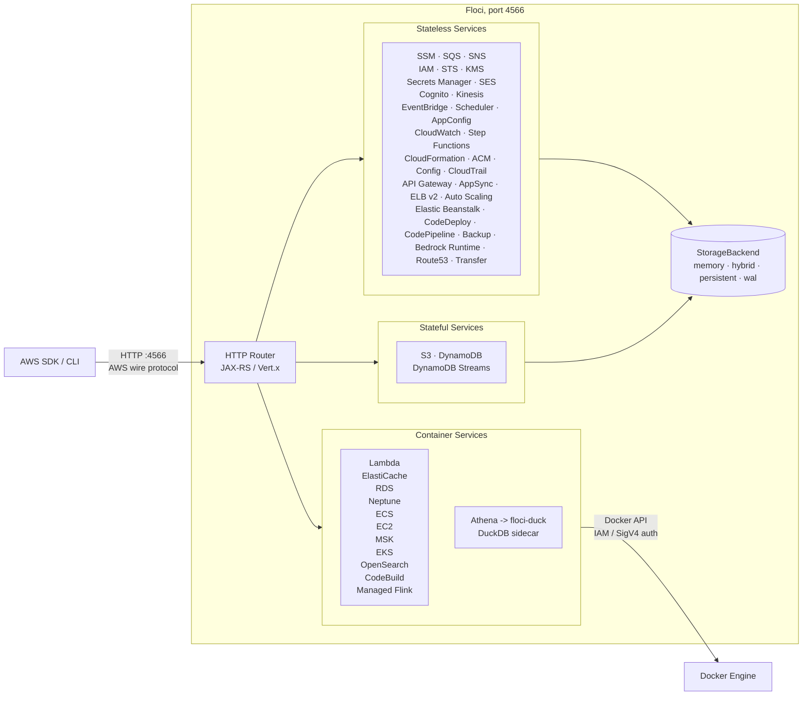

Ref: [Floci IO](https://github.com/floci-io/floci)

## Architecture Overview




# Q. How does Floci handles Amazon MongoDB/DocumentDB, ElasticCache, EKS and EC2 services locally?

Floci can natively handle all four of these services locally

 Floci uses a "Real Docker Backend" architecture. Instead of relying on shallow API mocks for complex infrastructure, Floci leverages your machine's local Docker socket to orchestrate real, fully functional underlying open-source engines. [1, 2, 3, 4, 5] 
The specific mechanisms for how Floci handles each service locally provide a blueprint for configuration.

## 📦 How floci manages these 4 services natively?

## 1. Amazon MongoDB (DocumentDB)

* How it handles it: When you issue a command to create an Amazon DocumentDB cluster, Floci automatically spins up a real, isolated Docker container running the official MongoDB engine backend. [1] 
* The Benefit: Your system gets actual DocumentDB wire protocol and query compatibility without requiring an abstract mock translation layer. [1, 2] 

## 2. Amazon ElastiCache

* How it handles it: Floci intercepts the ElastiCache API call and automatically provisions a real Redis container.
* The Benefit: It acts as a SigV4 proxy. If your application enforces AWS IAM database authentication to connect to ElastiCache, Floci intercepts and translates those secure AWS requests directly into the standard RESP (Redis) protocol. [6, 7] 

## 3. Amazon Elastic Kubernetes Service (EKS)

* How it handles it: Executing CreateCluster instructs Floci to deploy an actual, lightweight k3s (Kubernetes) cluster inside a nested container environment. [8, 9] 
* The Benefit: It outputs standard kubeconfig data, allowing you to point your native local kubectl or Helm clients directly at it to run actual deployments, pods, and ingress routing loops. [8, 9, 10] 

## 4. Amazon EC2

* How it handles it: When your application calls RunInstances, Floci spawns a standard Docker container to mimic an EC2 instance.
* The Benefit: It automatically injects your requested SSH keys, executes your base64-encoded UserData scripts upon boot, and provides a functioning internal Instance Metadata Service (IMDSv1 & IMDSv2). This ensures code inside the "VM" can fetch mock IAM instance profile credentials natively. [8] 

## 🚨 Crucial Pre-requisite for KinD / Multi-Container Environments
Because Floci needs to orchestrate these containers dynamically, you must mount your host system's Docker socket directly into the Floci image: [5] 

```yaml
volumes:
  - /var/run/docker.sock:/var/run/docker.sock # 👈 Absolute requirement for EKS, EC2, and ElastiCache
```

Would you like assistance generating a complete docker-compose config that bridges Floci's dynamically generated containers with your primary development network architecture?

- [1] [https://github.com](https://github.com/floci-io/floci)
- [2] [https://blog-ocampoge.medium.com](https://blog-ocampoge.medium.com/floci-the-lightweight-local-aws-emulator-360d0030f504)
- [3] [https://www.reddit.com](https://www.reddit.com/r/aws/comments/1t1bomf/floci_now_runs_ec2_ecs_eks_and_codebuild_as_real/)
- [4] [https://fossunited.org](https://fossunited.org/c/mangalore/foss-meetup-june-2026/cfp/dj78oi5n5v)
- [5] https://floci.io
- [6] [https://floci.io](https://floci.io/aws/)
- [7] [https://dev.to](https://dev.to/nahuel990/localstack-is-dead-ministack-runs-real-databases-for-free-1lim)
- [8] [https://www.reddit.com](https://www.reddit.com/r/aws/comments/1t1bomf/floci_now_runs_ec2_ecs_eks_and_codebuild_as_real/)
- [9] [https://www.neteye-blog.com](https://www.neteye-blog.com/blog/2026/07/03/building-a-local-aws-dev-environment-with-floci-part-1-eks-and-ecr/)
- [10] [https://www.dennisokeeffe.com](https://www.dennisokeeffe.com/blog/2019-05-02-eks-basics)
