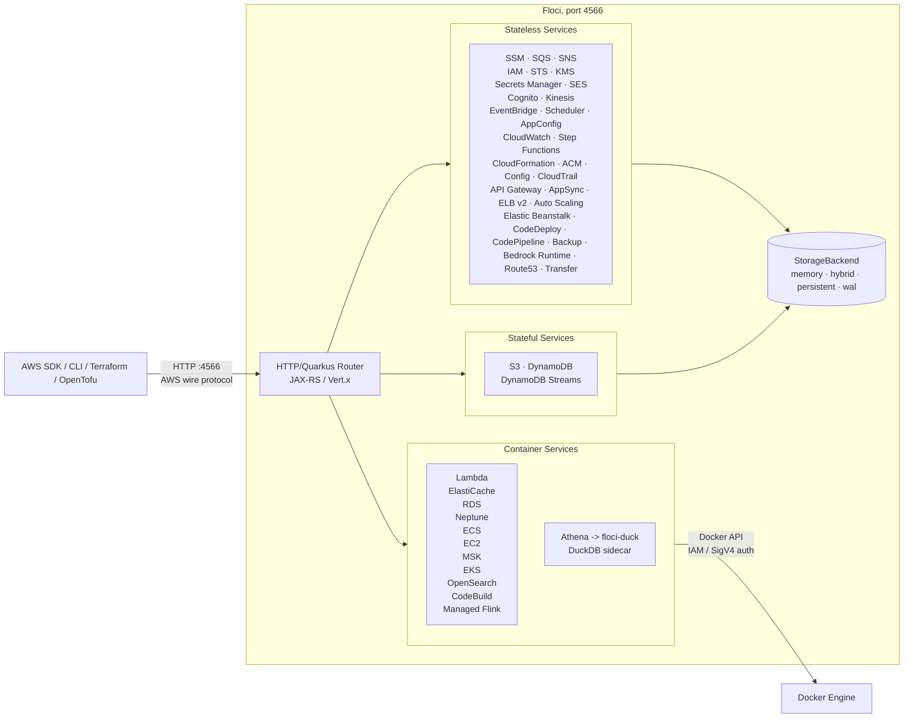

- [Floci IO](https://github.com/floci-io/floci)
- [Article 1](https://blog-ocampoge.medium.com/floci-the-lightweight-local-aws-emulator-360d0030f504)

# Architecture Overview

[Floci](https://floci.io/) is a highly efficient, free, and open-source local cloud emulator designed for development, testing, and CI/CD pipelines. It emerged as a prominent, MIT-licensed alternative to LocalStack following the commercialization and archiving of LocalStack's open-source community edition. [1, 2, 3, 4] 

The core architectural goal of Floci is to deliver true emulation rather than mock responses, allowing engineers to test complex cloud infrastructures entirely offline with virtually zero overhead. [5, 6, 7, 8, 9] 

## 🏛️ The Three-Layer Architecture
For every cloud service it emulates, the Floci Architecture breaks down into a clean, three-layer system: [10, 11] 

```txt

   [ ☁️ AWS SDK / CLI / Terraform / OpenTofu]
                  │
                  ▼
         ┌─────────────────┐
         │   HTTP Router   │  (Listens on standard port e.g., 4566)
         └────────┬────────┘
                  │
                  ├─────────────────────────┐
                  ▼                         ▼
       ┌─────────────────────┐   ┌─────────────────────┐
       │ In-Process Handlers │   │  Container Services │
       │ (Stateless/Stateful)│   │  (Real Docker Pods) │
       └──────────┬──────────┘   └──────────┬──────────┘
                  ▼                         ▼
         ┌─────────────────┐     ┌─────────────────┐
         │ Memory / Disk   │     │   Docker API    │
         │  Storage Modes  │     └─────────────────┘
         └─────────────────┘
```

### Layer 1. The Routing Layer (HTTP Router | Quarkus Router)

Acts as the entry point that intercepts incoming API traffic from your development tools (like the AWS SDK, CLI, Terraform, or OpenTofu). It routes requests seamlessly by matching wire-protocol signatures.

### Layer 2. The Service Execution Layer

To balance high performance with realistic behavior, Floci splits services into two handling paradigms:

* In-Process Handlers: Lightweight, stateless, or basic stateful services (such as S3, SQS, SNS, DynamoDB, IAM, and STS) run natively inside the core binary. They are built to be extremely fast and wire-protocol compatible.

* Container Services: Complex data and compute engines (such as AWS Lambda, RDS, ElastiCache, ECS, and EKS) do not use mock logic. Instead, Floci uses the Docker API to dynamically orchestrate real, isolated underlying engines (e.g., spawning a true PostgreSQL instance for RDS, or a Redpanda instance for MSK). This guarantees 100% protocol fidelity.

### Layer 3. The Storage & Persistence Layer

Manages data states through four distinct storage modes tailored to specific developer scenarios: Ephemeral In-Memory (great for fast AI sandboxes), Persisted Disk, Hybrid, and Write-Ahead Log (WAL) persistence.

## ⚡ Key Architectural Capabilities & Tech Stack




### Quarkus and GraalVM Native Image

Floci is built on the [Quarkus framework and Vert.x](https://www.youtube.com/watch?v=wQVQHuJ0FC0), and compiled into native binaries using GraalVM Mandrel. This compilation strategy achieves an under 24 ms startup time and a tiny 13 MB idle memory footprint, making it heavily optimized for resource-constrained developer laptops and fast CI runners.

### Multi-Cloud Emulation Architecture

While it began as a drop-in AWS alternative running on port 4566, the ecosystem quickly expanded into distinct, lightweight binaries for other major providers:
* **Floci (AWS):** Emulates over 75 AWS services.
* **Floci-AZ (Azure):** Emulates Cosmos DB, Blob Storage, AKS, and Functions.
* **Floci-GCP (Google Cloud):** Uses advanced ALPN negotiation to serve all gRPC and REST traffic over a single port (4588).

### Zero-Friction Operations

Unlike other corporate tools, Floci’s architecture requires no authentication tokens, no internet connections, and no feature gates. Every enterprise-grade feature is unlocked out-of-the-box.

# Q. How does Floci handles Amazon MongoDB/DocumentDB, ElasticCache, EKS and EC2 services locally?

Floci can natively handle all four of these services locally

 Floci uses a "Real Docker Backend" architecture. Instead of relying on shallow API mocks for complex infrastructure, Floci leverages your machine's local Docker socket to orchestrate real, fully functional underlying open-source engines. [1, 2, 3, 4, 5] 
The specific mechanisms for how Floci handles each service locally provide a blueprint for configuration.

## 📦 How floci manages these 4 services natively?

#### 1. Amazon MongoDB (DocumentDB)

* How it handles it: When you issue a command to create an Amazon DocumentDB cluster, Floci automatically spins up a real, isolated Docker container running the official MongoDB engine backend. [1] 
* The Benefit: Your system gets actual DocumentDB wire protocol and query compatibility without requiring an abstract mock translation layer. [1, 2] 

#### 2. Amazon ElastiCache

* How it handles it: Floci intercepts the ElastiCache API call and automatically provisions a real Redis container.
* The Benefit: It acts as a SigV4 proxy. If your application enforces AWS IAM database authentication to connect to ElastiCache, Floci intercepts and translates those secure AWS requests directly into the standard RESP (Redis) protocol. [6, 7] 

#### 3. Amazon Elastic Kubernetes Service (EKS)

* How it handles it: Executing CreateCluster instructs Floci to deploy an actual, lightweight k3s (Kubernetes) cluster inside a nested container environment. [8, 9] 
* The Benefit: It outputs standard kubeconfig data, allowing you to point your native local kubectl or Helm clients directly at it to run actual deployments, pods, and ingress routing loops. [8, 9, 10] 

#### 4. Amazon EC2

* How it handles it: When your application calls RunInstances, Floci spawns a standard Docker container to mimic an EC2 instance.
* The Benefit: It automatically injects your requested SSH keys, executes your base64-encoded UserData scripts upon boot, and provides a functioning internal Instance Metadata Service (IMDSv1 & IMDSv2). This ensures code inside the "VM" can fetch mock IAM instance profile credentials natively. [8] 

### 🚨 Crucial Pre-requisite for KinD / Multi-Container Environments

Because Floci needs to orchestrate these containers dynamically, you must mount your host system's Docker socket directly into the Floci image: [5] 

```yaml
volumes:
  - /var/run/docker.sock:/var/run/docker.sock # 👈 Absolute requirement for EKS, EC2, and ElastiCache
```

# Q. Why use Floci?

| Use Case                        | Why It Matters                                                              |
|---------------------------------|-----------------------------------------------------------------------------|
| Local cloud development         | Develop against real AWS APIs without network calls, cost, or account setup |
| CI/CD pipeline testing          | Run integration tests in ephemeral CI runners without AWS credentials       |
| Terraform / OpenTofu validation | Validate IaC plans and applies locally before touching real infrastructure  |
| Lambda experimentation          | Iterate on Lambda functions in milliseconds vs. the 10-second deploy cycle  |
| Offline development             | Work on flights, trains, or anywhere without internet                       |

> Floci makes all the above use cases painless. No sign-ups, no API keys, no telemetry. Pull the image and build.

### Ref:
- [1] [https://github.com](https://github.com/floci-io/floci)
- [2] [https://blog-ocampoge.medium.com](https://blog-ocampoge.medium.com/floci-the-lightweight-local-aws-emulator-360d0030f504)
- [3] [https://www.reddit.com](https://www.reddit.com/r/aws/comments/1t1bomf/floci_now_runs_ec2_ecs_eks_and_codebuild_as_real/)
- [4] [https://fossunited.org](https://fossunited.org/c/mangalore/foss-meetup-june-2026/cfp/dj78oi5n5v)
- [5] https://floci.io
- [6] [https://floci.io](https://floci.io/aws/)
- [7] [https://dev.to](https://dev.to/nahuel990/localstack-is-dead-ministack-runs-real-databases-for-free-1lim)
- [8] [https://www.reddit.com](https://www.reddit.com/r/aws/comments/1t1bomf/floci_now_runs_ec2_ecs_eks_and_codebuild_as_real/)
- [9] [https://www.neteye-blog.com](https://www.neteye-blog.com/blog/2026/07/03/building-a-local-aws-dev-environment-with-floci-part-1-eks-and-ecr/)
- [10] [https://www.dennisokeeffe.com](https://www.dennisokeeffe.com/blog/2019-05-02-eks-basics)
