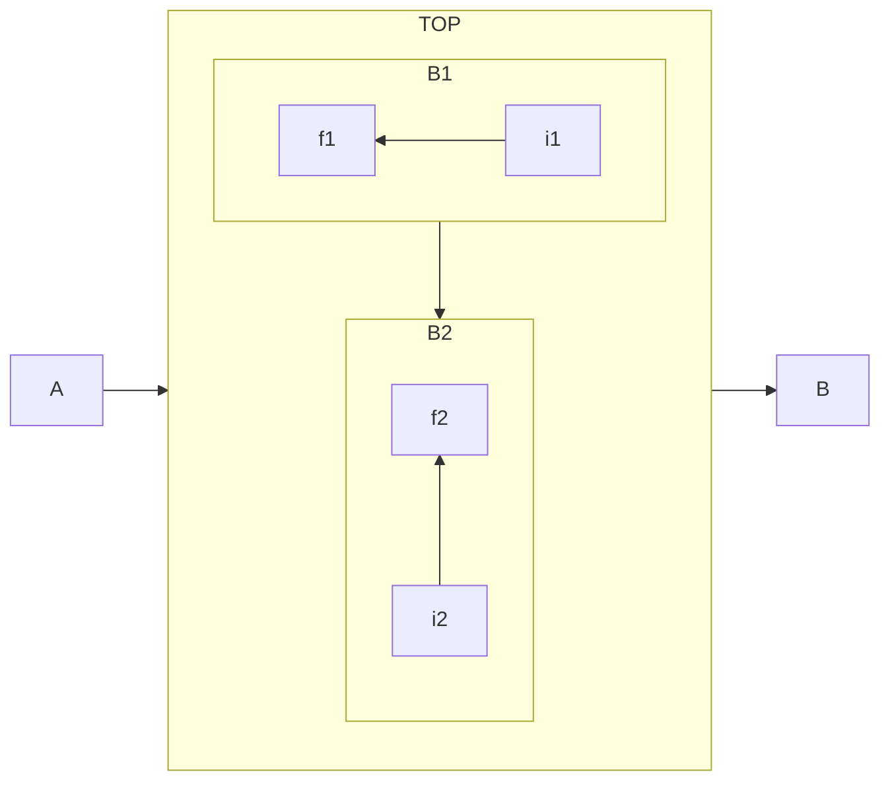
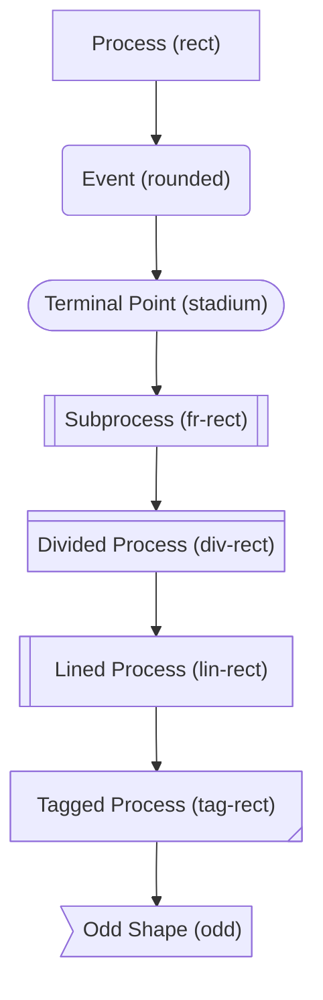
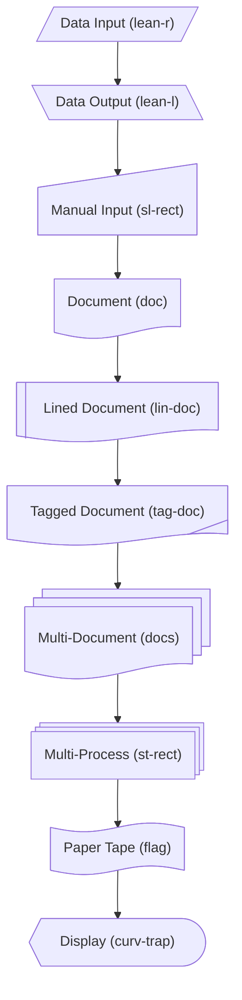
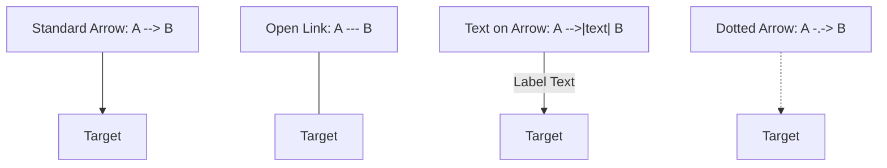
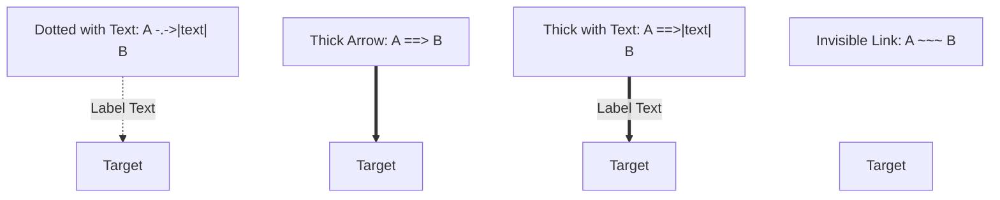

# Mermaid Synxtax

Ref: [Mermaid Synxtax](https://mermaid.ai/open-source/syntax/flowchart.html)

### New Node Synxtax

```mmd
node_name@{ img: "https://example.com/image.png", label: "Image Label", pos: "t", w: 60, h: 60, constraint: "off" }
```

### New Edge Synxtax

```mmd
  A edge_name@==> B
  edge_name@{ curve: linear, animate: true, animation: fast }
```

### Directions in Graph

```mmd
flowchart LR
  subgraph TOP
    direction TB
    subgraph B1
        direction RL
        i1 -->f1
    end
    subgraph B2
        direction BT
        i2 -->f2
    end
  end
  A --> TOP --> B
  B1 --> B2
```

> **Limitation:** If any of a subgraph's nodes are linked to the outside, subgraph direction will be ignored. Instead the subgraph will inherit the direction of the parent graph:



### Mermaid Font Support

Supported prefixes: fa, fab, fas, far, fal, fad.

```mmd
flowchart TD
    B["fa:fa-twitter for peace"]
    B-->C[fa:fa-ban forbidden]
    B-->D(fa:fa-spinner)
    B-->E(A fa:fa-camera-retro perhaps?)
```

# Mermaid Shapes

Ref: [Mermaid Document](https://github.com/mermaid-js/mermaid/blob/develop/README.md) 

### 1. Standard & Process Shapes (Basic)



### 2. Data & Input/Output Shapes (Data)



### 3. Storage & Database Shapes (Storage)

```mermaid
flowchart TD
    cyl@{ shape: cyl, label: "Database (cyl)" }
    --> datastore@{ shape: datastore, label: "Data Store (datastore)" }
    --> h_cyl@{ shape: h-cyl, label: "Direct Access (h-cyl)" }
    --> lin_cyl@{ shape: lin-cyl, label: "Disk Storage (lin-cyl)" }
    --> win_pane@{ shape: win-pane, label: "Internal Storage (win-pane)" }
    --> bow_rect@{ shape: bow-rect, label: "Stored Data (bow-rect)" }
    --> bucket@{ shape: bucket, label: "Bucket (bucket)" }
    --> folder@{ shape: folder, label: "Folder (folder)" }
    --> flip_tri@{ shape: flip-tri, label: "Manual File (flip-tri)" }

```

### 4. Control, Flow & Special Shapes (Control)

```mermaid
flowchart TD
    diam@{ shape: diam, label: "Decision (diam)" }
    --> hex@{ shape: hex, label: "Prepare / Condition (hex)" }
    --> circle@{ shape: circle, label: "Start (circle)" }
    --> sm_circ@{ shape: sm-circ, label: "Small Start (sm-circ)" }
    --> dbl_circ@{ shape: dbl-circ, label: "Stop (dbl-circ)" }
    --> fr_circ@{ shape: fr-circ, label: "Framed Circle (fr-circ)" }
    --> cross_circ@{ shape: cross-circ, label: "Summary (cross-circ)" }
    --> trap_b@{ shape: trap-b, label: "Priority Action (trap-b)" }
    --> trap_t@{ shape: trap-t, label: "Manual Operation (trap-t)" }
    --> notch_pent@{ shape: notch-pent, label: "Loop Limit (notch-pent)" }
    --> delay@{ shape: delay, label: "Delay (delay)" }
    --> fork@{ shape: fork, label: "Fork/Join (fork)" }
    --> f_circ@{ shape: f-circ, label: "Junction (f-circ)" }
    --> hourglass@{ shape: hourglass, label: "Collate (hourglass)" }
    --> tri@{ shape: tri, label: "Extract (tri)" }
    --> notch_rect@{ shape: notch-rect, label: "Card (notch-rect)" }
    --> bang@{ shape: bang, label: "Bang (bang)" }
    --> browser@{ shape: browser, label: "Browser (browser)" }
    --> cloud@{ shape: cloud, label: "Cloud (cloud)" }
    --> console@{ shape: console, label: "Console (console)" }
    --> person@{ shape: person, label: "Person (person)" }
    --> bolt@{ shape: bolt, label: "Com Link (bolt)" }
    --> text@{ shape: text, label: "Text Block (text)" }
    --> brace@{ shape: brace, label: "Comment (brace)" }
    --> brace_r@{ shape: brace-r, label: "Comment Right (brace-r)" }
    --> braces@{ shape: braces, label: "Comment Both (braces)" }

```
### 5. Link & Arrow Types



